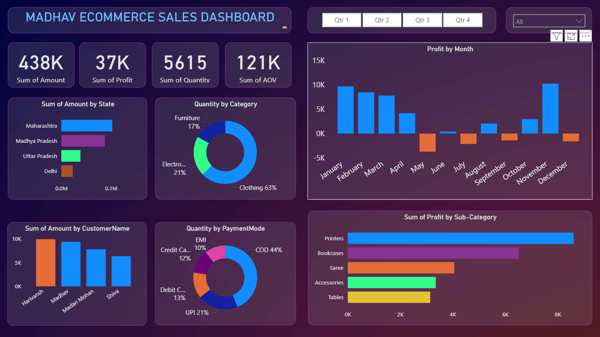

# PowerBI-Ecommerce-Sales-Dashboard
Ecommerce Sales dashboard built using Power BI to analyze KPIs like sales, profit, quantity, AOV, with interactive filters &amp; customized visuals. Includes PBIX file, CSV files &amp; readme documentation.

# Madhav Ecommerce Sales Dashboard (Power BI Project)

This is an interactive Power BI dashboard created to analyze and visualize online ecommerce sales data.

## 🚀 Project Highlights

- Built a visually appealing and interactive dashboard to track **Sales**, **Profit**, **Quantity**, and **AOV**
- Used user-driven filters such as **Quarter slicers** and **State dropdown** to drill-down and customize reports
- Connected multiple tables and performed **data modelling, relationships & calculations** using DAX
- Applied **customized visualizations** (Bar, Column, Donut, Pie, Clustered Bar, Map, Slicers) to gain insights

## 📊 Key Visuals Included

| Metric                   | Visualization Type          |
|--------------------------|-----------------------------|
| Sum of Amount, Profit    | KPI Cards                   |
| Quantity by Category     | Donut Chart                 |
| Profit by Month          | Column Chart                |
| Profit by Sub-Category   | Horizontal Bar Chart        |
| Amount by State          | Bar Chart                   |
| Customer Name Analysis   | Column Chart                |
| Sales by Payment Mode    | Donut Chart                 |

## 🛠 Technical Stack

- **Power BI Desktop**
- **Data Modelling (Relationships)**
- **DAX for calculated fields**
- **Interactive Filters & Slicers**

## 📁 Files Included

| File Name                             | Description                               |
|----------------------------------------|-------------------------------------------|
| `Madhav_Ecommerce_Sales_Dashboard.pbix`| Power BI Dashboard File                   |
| `images/`                              | Screenshot previews of the dashboard      |
| `README.md`                            | Project Overview & Documentation          |

## 📷 Dashboard Preview

## ✨ Project Learnings

- Created interactive dashboard to track and analyze online sales data  
- Used complex parameters to drill down and customize visualization using filters & slicers  
- Joined tables, created connections and wrote DAX for manipulating data & calculations  
- Built multiple customized visuals for deep-insights  

---

💡 *Feel free to download the `.pbix` file, connect your own dataset, and modify the visuals as per your needs!*
